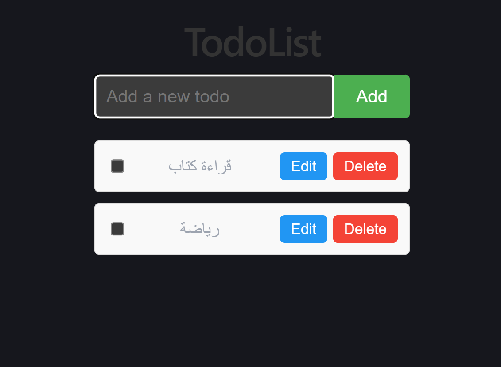

# Todo App



A simple todo list application built with React, TypeScript, and Vite.

## Overview

This repository contains a minimal frontend app that lets users:

- add new todo items
- mark todos as complete
- edit existing todos
- delete todos

The app is built as a single-page client-side application with no backend or persistence.

## Features

- React functional components with hooks
- TypeScript for type safety
- Vite for fast development and build
- Basic todo editing and completion state

## Getting Started

### Install dependencies

```bash
npm install
```

### Run the app locally

```bash
npm run dev
```

Then open the local URL shown in the terminal.

### Build for production

```bash
npm run build
```

### Preview the production build

```bash
npm run preview
```

### Lint the code

```bash
npm run lint
```

## Project structure

- `src/` - application source files
- `src/App.tsx` - main todo app component
- `src/App.css` - app styling
- `public/` - static assets
- `index.html` - application entry point
- `vite.config.ts` - Vite configuration

## Notes

- Todos are stored in local state only and reset on page refresh.
- This repository is a good starting point for learning React + TypeScript with Vite.
